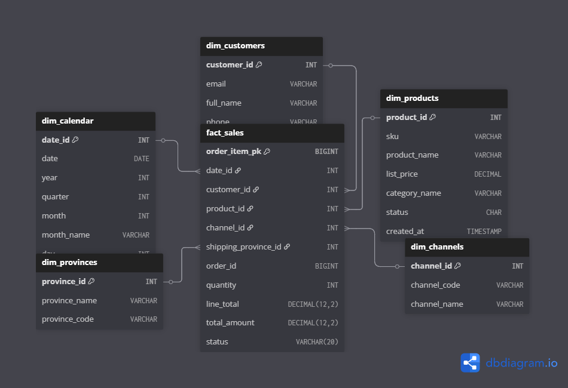
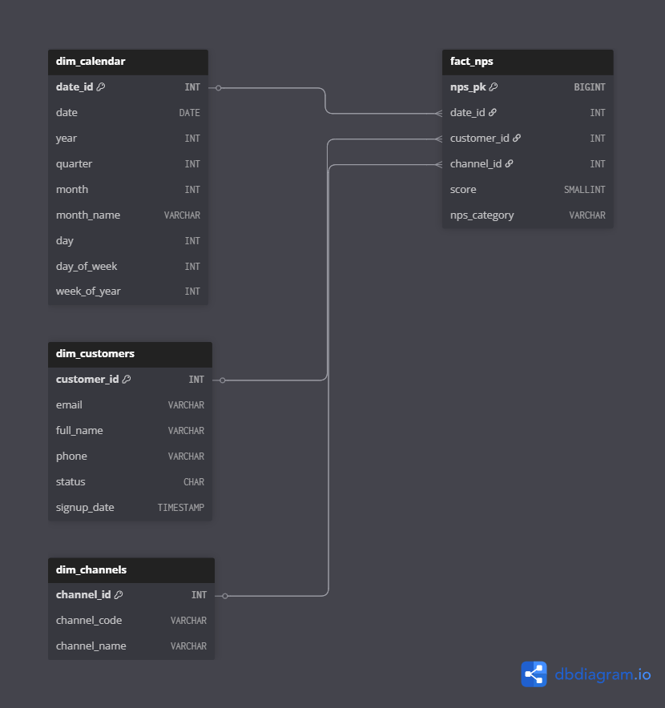
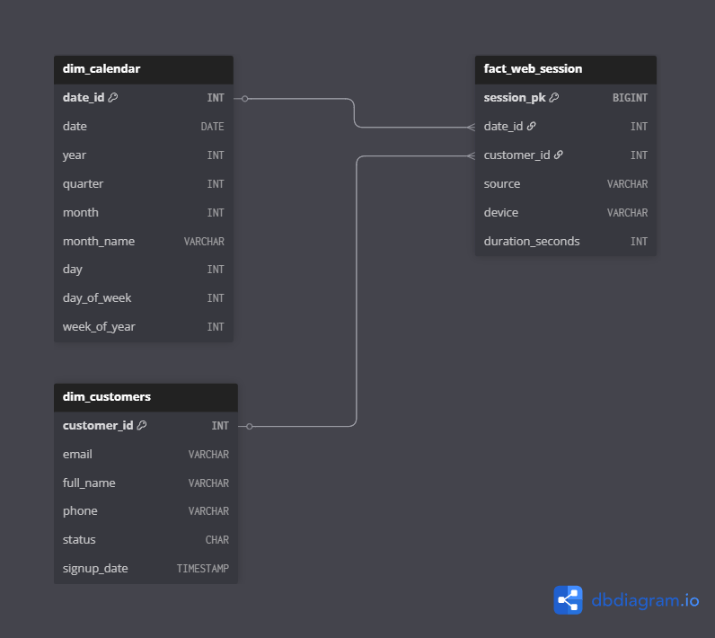
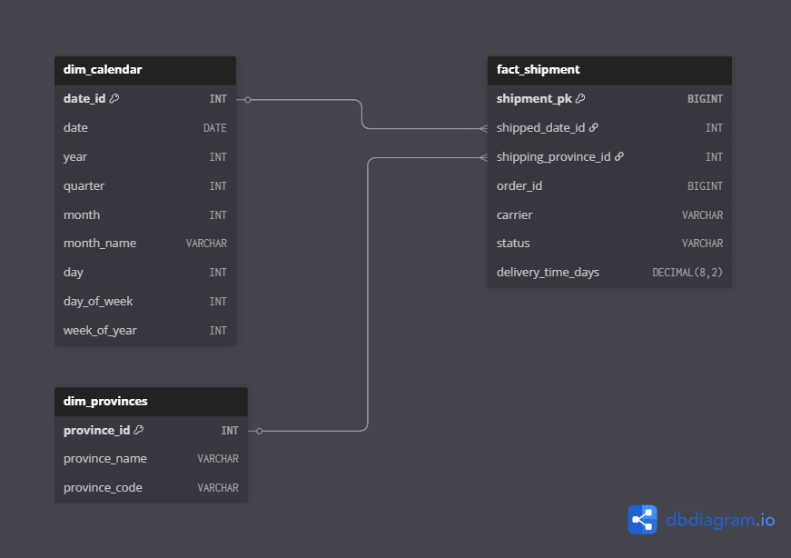

# Trabajo Práctico Final EcoBottle — Introducción al Marketing Online y los Negocios Digitales

El objetivo es diseñar e implementar un mini-ecosistema de datos comercial (online + offline) para la empresa ficticia EcoBottle AR. El pipeline utiliza datos transaccionales (RAW) para construir un Data Warehouse dimensional (Esquema Estrella) y alimentar un Dashboard de Looker Studio con KPIs clave para el área comercial.

## Instrucciones de Ejecución Local:
Para reproducir el pipeline de datos, sigue los siguientes pasos desde la terminal.

**1- Clonar el Repositorio**
**Cambia 'TU_USUARIO' por tu nombre de usuario de GitHub**
git clone https://github.com/TU_USUARIO/mkt_tp_final.git
cd mkt_tp_final

**2- Crear y Activar un Entorno Visual**
**Crear entorno virtual**
python3 -m venv .venv

**Activar en macOS/Linux**
source .venv/bin/activate

**Activar en Windows (PowerShell)**
.\.venv\Scripts\Activate

**3- Instalar dependencias**
pip install -r requirements.txt

**4- Ejecutar el Pipeline de transformación**
El script main.py leerá los datos de data/raw/, construirá el esquema estrella y guardará los resultados en warehouse/.
python main.py

**5- Verificar la salida**
Tras la ejecución exitosa, la carpeta warehouse/ contendrá las subcarpetas dim/ y fact/ con los datos transformados listos para ser usados en Looker Studio.

---

## Diccionario de datos y supuestos
El Data Warehouse se diseñó bajo el Esquema Estrella de Kimball para optimizar el análisis de KPIs clave.

**A- Tablas de Hechos - Fact Tables**

| Tabla (granularidad) | Uso principal (KPIs) | PK | FKs clave |
|---|---|---|---|
| fact_sales (Línea de Pedido) | Ventas, Ticket promedio, Ranking por producto | order_item_pk | date_id, product_id, channel_id, shipping_province_id |
| fact_web_session (Sesión Web) | Usuarios activos  | session_pk | start_date_id, customer_id |
| fact_nps_response (Respuesta NPS) | NPS | nps_pk | date_id, customer_id, channel_id |

**B- Tablas de Dimensiones - Dimension Tables**
| Tabla | Origen (RAW) | Propósito Analítico |
|---|---|---|
| dim_calendar | Generada en ETL | Series temporales y agrupación mensual/trimestral |
| dim_customers | customer | Segmentación de usuarios activos y NPS |
| dim_products | product, product_category | Filtro por Producto (Classic A y Sport B) |
| dim_channel | channel | Filtro por Canal de Venta (Online/Offline) |
| dim_province | province, address | Análisis geográfico (Ventas por provincia) |

**C- Supuestos del modelado**

**Ventas por Provincia**
Se utiliza el province_id de la dirección de envío (shipping_address_id) para el cálculo geográfico de Ventas.

**Granularidad de Ventas**
La métrica de Ventas ($M) se calcula sobre órdenes con status 'PAID' o 'FULFILLED'.

**Usuarios activos**
Se considera un usuario activo si tiene un customer_id conocido en web_session, o si al menos existe un session_id anónimo en el período, dependiendo del nivel de seguimiento en la transformación.

---

## Esquemas estrella

**1. Esquema Estrella: Ventas (`FACT_SALES`)**

**2. Esquema Estrella: Satisfacción (`FACT_NPS`)**

**3. Esquema Estrella: Actividad Web (`FACT_WEB_SESSION`)**

**4. Esquema Estrella: Logística (`FACT_SHIPMENT`)**

---

## Consultas clave y lógica de KPIs

Esta sección describe la lógica (similar a SQL o DAX) para calcular los KPIs en el dashboard.

| KPI | Lógica de agregación | Base de Datos (Tablas DW) |
|---|---|---|
| Total Ventas ($M) | SUM(total_amount_order) | fact_sales (filtrando status = PAID / FULFILLED) |
| Ticket Promedio ($K) | SUM(total_amount_order) / COUNT(DISTINCT order_id) | fact_sales (filtrando status = PAID / FULFILLED) |
| Usuarios activos (nK) | COUNT(DISTINCT customer_id) | fact_web_session |
| NPS | ((%Promotores - %Detractores)) x 100 | fact_nps_response (Score 9-10 Promotor, 0-6 Detractor) |
| Ranking por producto | SUM(line_total) agrupado por product_id y date.month | fact_sales y dim_calendar |

---

## Dashboard Final Looker Studio
Enlace al tablero de Looker Studio
(enlace)
