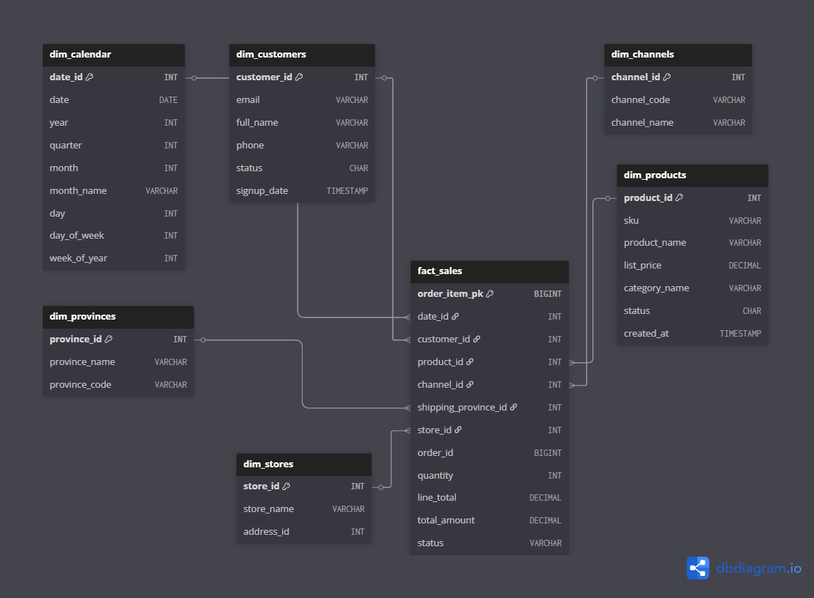
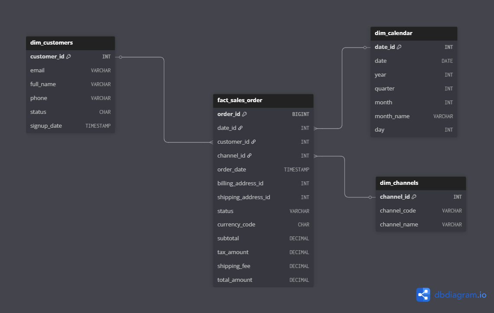
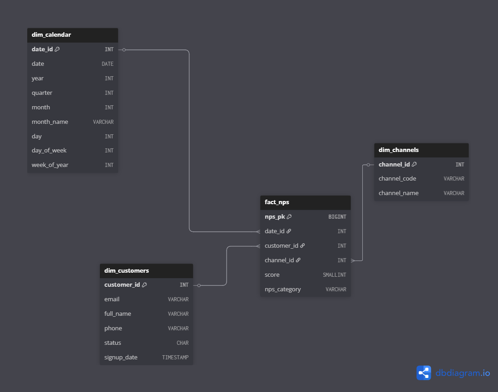
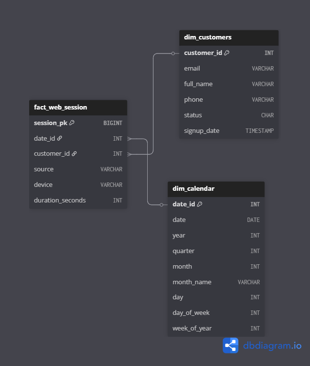
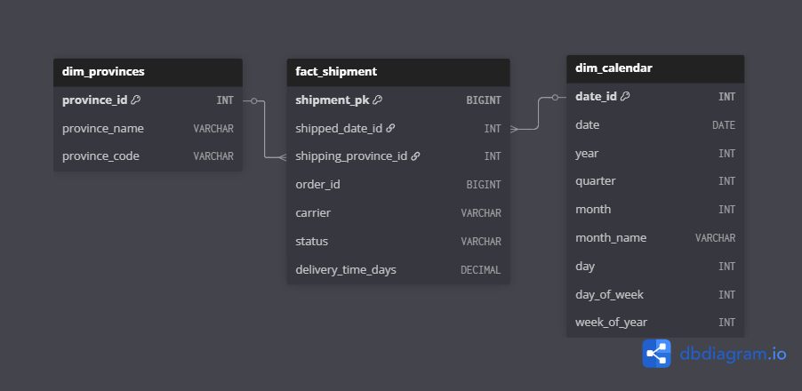
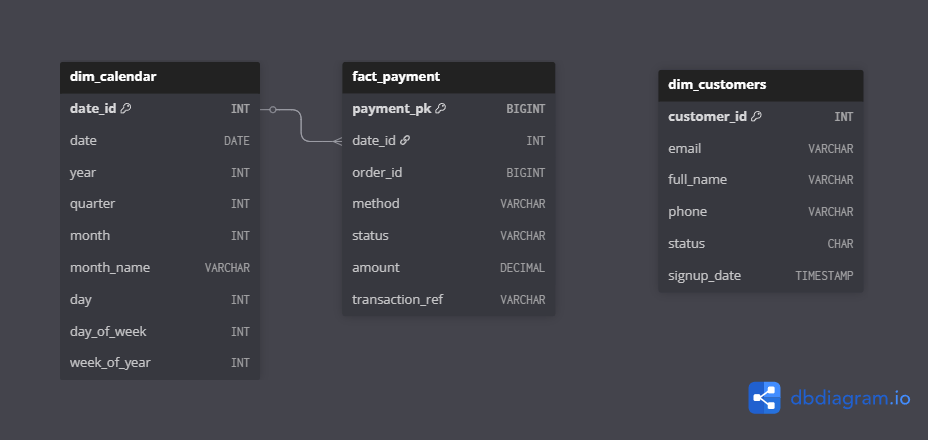

# ♻️ Trabajo Práctico Final EcoBottle — Introducción al Marketing Online y los Negocios Digitales

El presente trabajo práctico tiene como objetivo aplicar los conocimientos adquiridos **sobre procesos ETL (Extract, Transform, Load), modelado de datos y visualización de información**, desarrollando un **Data Warehouse** y un **dashboard analítico** en Power BI.

A partir de un conjunto de datos transaccionales de una empresa de comercio electrónico, se buscó:

• Diseñar e implementar un **proceso ETL completo en Python**, capaz de extraer, transformar y cargar los datos desde distintas fuentes.
• Construir un **modelo dimensional (esquema en estrella)** que permita analizar métricas de negocio como ventas, clientes, productos, pagos y envíos.
• Generar **tablas desnormalizadas** dentro de la carpeta DW/ para su consumo directo desde herramientas de BI.
• Diseñar un **dashboard interactivo** en Power BI que muestre los principales indicadores de gestión y rendimiento.

El proyecto fue desarrollado siguiendo buenas prácticas de ingeniería de datos: modularización del código, control de versiones con Git, entorno virtual gestionado con ```venv``` y documentación completa mediante este archivo ```README.md```.

## 🚀 Instrucciones de Ejecución Local:
Para reproducir el pipeline de datos, sigue los siguientes pasos desde la terminal.

## 1️⃣ Clonar el Repositorio

**Cambia 'TU_USUARIO' por tu nombre de usuario de GitHub**
```git clone https://github.com/TU_USUARIO/mkt_tp_final.git
cd mkt_tp_final```

## 2️⃣ Crear y Activar un Entorno Visual


```# Crear entorno virtual
python3 -m venv .venv

# Activar en macOS/Linux
source .venv/bin/activate

# Activar en Windows (PowerShell)
.\.venv\Scripts\Activate```

## 3- Instalar dependencias
pip install -r requirements.txt

## 4- Ejecutar el Pipeline de transformación
El script main.py leerá los datos de data/raw/, construirá el esquema estrella y guardará los resultados en warehouse/.
python main.py

## 5- Verificar la salida
Tras la ejecución exitosa, la carpeta warehouse/ contendrá las subcarpetas dim/ y fact/ con los datos transformados listos para ser usados en Power BI.


---

## 🗂️ Arquitectura del Proyecto (Estructura ETL)

El proyecto organiza el flujo de datos desde el origen (RAW) hasta el destino listo para el análisis (warehouse/).

```
├── assets/                  # Diagramas, capturas o imágenes del proyecto
├── dashboard.pbix           # Tablero de visualización de Power BI
├── etl/                     # Lógica ETL (Extract, Transform, Load) en scripts Python
│   ├── transform_dims.py    # Scripts para la creación y desnormalización de Dimensiones
│   └── transform_facts.py   # Scripts para la creación de Tablas de Hechos
├── RAW/                     # Datos fuente originales (.csv) provistos por el profesor
├── warehouse/               # Data Warehouse - Contiene los archivos .csv finales listos para el análisis
│   ├── dim/                 # Tablas de Dimensiones desnormalizadas
│   └── fact/                # Tablas de Hechos desnormalizadas
├── .gitignore               # Archivos y carpetas ignorados por Git
├── LICENSE                  # Licencia del proyecto
├── main.py                  # Script principal para orquestar la ejecución del ETL
├── requirements.txt         # Archivo con las dependencias Python requeridas 
└── README.md                # Documentación del proyecto
```


## Diccionario de datos y supuestos
El Data Warehouse se diseñó bajo el Esquema Estrella de Kimball para optimizar el análisis de KPIs clave.

**A- Tablas de Hechos - Fact Tables**

| Tabla (granularidad) | Uso principal (KPIs) | PK | FKs clave |
|---|---|---|---|
| ```fact_sales``` (Línea de Pedido) | Ventas, ticket promedio, ranking por producto | ```order_item_pk``` | ```date_id```, ```product_id```, ```channel_id```, ```shipping_province_id``` |
| ```fact_sales_order``` (Cabecera de Pedido) | Análisis de órdenes, filtrado por status y canales | ```order_id_pk``` | ```channel_id```, ```date_id```, ```customer_id``` |
| ```fact_web_session``` (Sesión Web) | Usuarios activos  | ```session_pk``` | ```start_date_id```, ```customer_id``` |
| ```fact_nps_response``` (Respuesta NPS) | NPS | ```nps_pk``` | ```date_id```, ```customer_id```, ```channel_id``` |

**B- Tablas de Dimensiones - Dimension Tables**
| Tabla | Propósito Analítico |
|---|---|
| ```dim_calendar``` | Series temporales y agrupación mensual/trimestral |
| ```dim_customers``` | Segmentación de usuarios activos y NPS |
| ```dim_products``` | Filtro por Producto (Classic A y Sport B) |
| ```dim_channel``` | Filtro por Canal de Venta (Online/Offline) |
| ```dim_province``` |Análisis geográfico (Ventas por provincia) |

**C- Supuestos del modelado**

**Ventas por Provincia**
Se utiliza el province_id de la dirección de envío (shipping_address_id) para el cálculo geográfico de Ventas.

**Granularidad de Ventas**
La métrica de Ventas ($M) se calcula sobre órdenes con status 'PAID' o 'FULFILLED'.

**Usuarios activos**
Se considera un usuario activo si tiene un customer_id conocido en web_session, o si al menos existe un session_id anónimo en el período, dependiendo del nivel de seguimiento en la transformación.

---

## Esquemas estrella

**1. Esquema Estrella: Ventas (```FACT_SALES```)**



**2. Esquema Estrella: Cabecera de pedido (```FACT_SALES_ORDER```)**



**3. Esquema Estrella: Satisfacción (```FACT_NPS```)**



**4. Esquema Estrella: Actividad Web (```FACT_WEB_SESSION```)**



**5. Esquema Estrella: Logística (```FACT_SHIPMENT```)**



**6. Esquema Estrella: Pagos (```FACT_PAYMENT```)**



---


## Consultas clave y lógica de KPIs

Esta sección describe la lógica (DAX) para calcular los KPIs en el dashboard.

| KPI | Lógica de agregación |
|---|---|
| Usuarios activos (nK) | ```DISTINCTCOUNT('fact_web_session'[customer_id])``` |
| NPS | ```VAR Total_Respuestas = COUNTROWS('fact_nps') VAR Promotores = CALCULATE( COUNTROWS('fact_nps'), 'fact_nps'[nps_category] = "Promoter" ) VAR Detractores = CALCULATE( COUNTROWS('fact_nps'), 'fact_nps'[nps_category] = "Detractor" ) VAR Porcentaje_Promotores = DIVIDE(Promotores, Total_Respuestas, 0) VAR Porcentaje_Detractores = DIVIDE(Detractores, Total_Respuestas, 0) RETURN (Porcentaje_Promotores - Porcentaje_Detractores) * 100``` |

---

## Dashboard Final Power BI
Enlace al tablero

